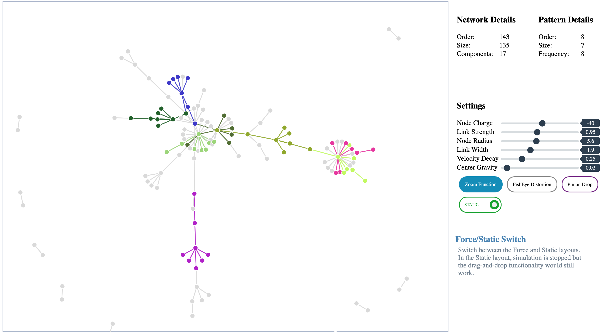
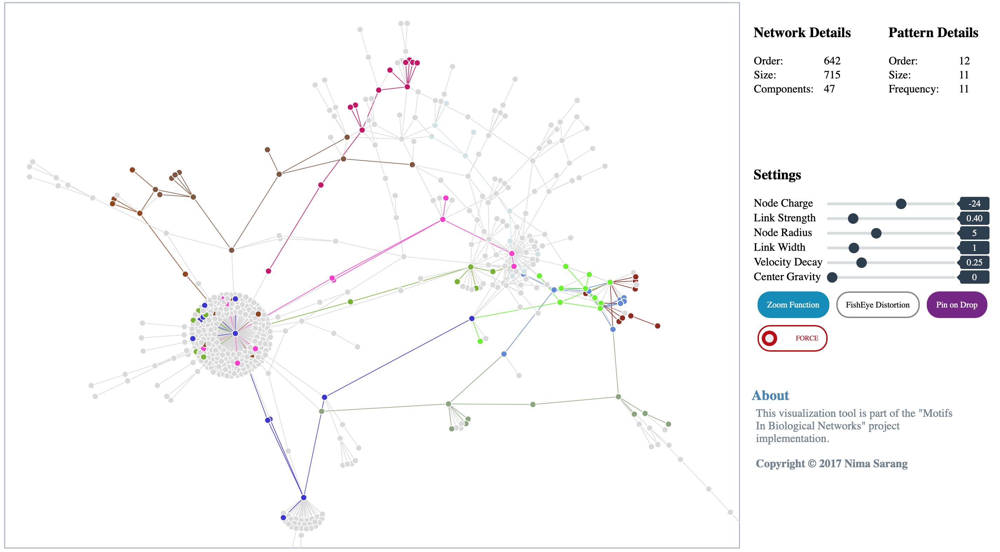

# Identifying Motifs in Biological Networks

## Overview
This repo is based on an implementation of the paper [Identification of large disjoint motifs in biological networks](https://bmcbioinformatics.biomedcentral.com/articles/10.1186/s12859-016-1271-7).  
Biological networks provide great potential to understand how cells function. Network motifs, common topological patterns, are critical structures through which biological networks operate. Finding motifs in biological networks remains to be a computationally challenging task as the size of the motif and the underlying network grow. Often, different copies of a given motif topology in a network share nodes or edges. Counting such overlapping copies introduces significant problems in motif identification.

## Citation
> Elhesha R, Kahveci T. Identification of large disjoint motifs in biological networks. BMC Bioinformatics. 2016;17(1):408.  
  
## Installation
```bash
git clone  https://github.com/nsarang/motif_bionet.git
cd motif_bionet
make
```
  
## Usage  
The input file is the representation of a biological network in the format of its edge list. The output is a TXT file, summarizing results. A JSON is also created for visualization purposes.  

```bash
motifnet <inp_path> <out_path> <alpha> <mu>
```
<pre>
    &lt;inp_path>    Path to the biological network 
    &lt;out_path>    Path to the output file. A JSON file is also created  
    &lt;alpha>       Number of nodes of the motif  
    &lt;mu>          Cut-off of the motif frequency
</pre>
    
**Example**:  
`motifnet data/cje.txt output/motif 7 5`
  
## Dataset
A real and synthetic dataset is provided by the [Bioinformatics Lab @ UF](http://bioinformatics.cise.ufl.edu/code/nm-data.zip)  
<br />  
## Visualization
An interactive visualization tool is provided using d3.js library. Here the steps to make it work:
1. Put the JSON file in the **output** directory by the name **motif.json**
2. Start the python HTTP server. `python output/server.py`
3. Go to the `localhost:9999` address using your favorite browser (Chrome recommended)

## Screenshots  
*Visualization on default settings:*
  
  
*Changing node radius and center gravity:*
  
  
*Using FishEye distortion and highlighting:*
  
  
*A bigger dataset:*
  

